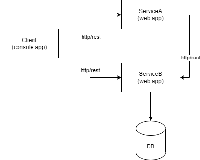
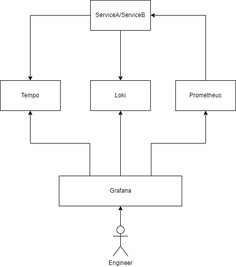

# springboot-observability
SpringBoot Application Observability demo with Prometheus, Loki, Tempo, Grafana.

## Context
The goal of this demo is to show application monitoring and tracing.  

There are 3 SpringBoot applications in the project: 
- Client (console app)
- ServiceA (web app)
- ServiceB (web app)



The client is used to generate requests to ServiceA or ServiceB. Itself it not part of the monitoring setup.
ServiceA calls (http/rest) ServiceB to complete handling of its requests. 
ServiceB calls DB only (no other service)

## Monitoring/Observability Setup



### Monitoring (Prometheus)
Micrometer, Spring Actuator and Prometheus are used for monitoring.
Actuator endpoints are scraped by Prometheus on regular intervals to gain insights of application health.

### Logs Aggregation (Grafana Loki)
Logs are collected and pushed to Grafana Loki. (com.github.loki4j.logback.Loki4jAppender).

### Tracing (Grafana Tempo)
TraceId and SpanId are added to every log by Spring Cloud Sleuth (today part of Micrometer).
The logs are then pushed to Tempo for analysis (request latency, spans etc.)

### Visualization (Grafana)
Grafana is used as a main UI and is common ground for all the tools as it offers tight integration with all of them.
Grafana offers the possibility for creating custom user dashboards, or import existing dashboards from its marketplace.

#### Notes:
Grafana Loki Query: ``` {app=~".+"} | pattern ` <type> [<app_name>,<trace_id>,<span_id>] <java_class> <_> : <msg>` ``` 


